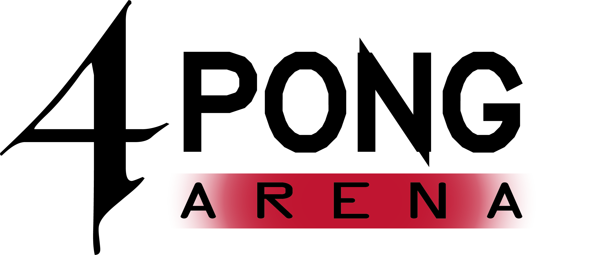
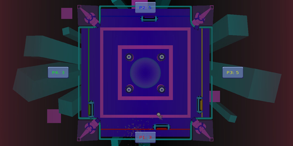

# 4-Pong Arena

# Game Concept
**4-Pong Arena** is a local multiplayer arcade game for up to 4 players in the same vein as classics such as Pong, but with twice the pads, multiple times the balls in play and a hundred times the fun. Users can play against other players, and computer-controlled pads with AI behaviour, in frantic Pong matches with random ball spawns, electric scenarios and fist-pumping music to acompany it all.

But that's not all. Every map can be adjusted with different obstacles such as bouncers in the middle of the map, and a force field of different sizes that powers-up any ball that goes inside with more speed, to make it harder for whomever is on the other side of the field.

# About the game

4-Pong Arena is a game made for the 'Proyecto III' subject as part of the bachelor's degree in Video Game Design and Development from the 'Universidad Complutense de Madrid', year 2019-2020.

This game has been created from scratch in just a three month span using [Gaia(c)](https://spicy-noodles-studio.github.io/Gaia/) as the engine.
 
4-Pong Arena has been designed and created by Spicy Noodles(c), all rights reserved.

# Lore

The entire kingdom gathers to watch the Ghost Games!

Years ago, a curse was casted upon the kingdom and condemned the dead to return as ghosts. The King ordered to lock all those affected in the castle dungeons and gradually the curse dissapeared from the kingdom.

Despite knowing the cure, the King has taken the opportunity to create a show that attracts tourists from other kingdoms.

The king created a tournament where soldiers who were affected by the curse, and have not been treated, face each other in a battle to the death. The victor gains his freedom and the cure to the curse.

You are one of those soldiers and you must show your skill and cunning in combat against the rest.

# Controls

- KEYBOARD AND MOUSE
	- MOVEMENT: A / D
	- QUICK ATTACK: LEFT CLICK
	- STRONG ATTACK: RIGHT CLICK
	- JUMP: W / SPACEBAR
	- GRIP: E
	- LOCK: S
	- AVOID: SHIFT + MOVEMENT
	- GHOST PUNCH: MOUSE POINT + QUICK ATTACK

- CONTROLLER
	- MOVEMENT: LEFT JOYSTICK
	- QUICK ATTACK: X / Square
	- SLOW ATTACK: Y / Triangle
	- JUMP: A / Cross / LEFT JOYSTICK UP
	- GRIP: LB / L1
	- LOCK: B / Circle
	- AVOID: LT / L2
	- GHOST PUNCH:
		- AIM: KEEP RT / R2 AND AIM WITH JOYSTICK RIGHT
		- PUNCH: RELEASE RT / R2
		- CANCEL: WHILE HOLDING RT / R2, PRESS B / Circle

# Acknowledgments

MUSIC:
Most of the music of UGP has been created by other artists outside of Spicy Noodles(c) with free use licenses: 

- Strength Of The Titans by Kevin MacLeod
	Link: https://incompetech.filmmusic.io/song/5744-strength-of-the-titans
	License: http://creativecommons.org/licenses/by/4.0/

- District Four by Kevin MacLeod
	Link: https://incompetech.filmmusic.io/song/3662-district-four
	License: http://creativecommons.org/licenses/by/4.0/

- Bustin Loose <a href="https://audionautix.com/">Creative Commons Music by Jason Shaw on Audionautix.com</a>
- Cycles <a href="https://audionautix.com/">Creative Commons Music by Jason Shaw on Audionautix.com</a>
- Green Daze <a href="https://audionautix.com/">Creative Commons Music by Jason Shaw on Audionautix.com</a>
- Hip Hop No Vocal <a href="https://audionautix.com/">Creative Commons Music by Jason Shaw on Audionautix.com</a>
- OpusOne <a href="https://audionautix.com/">Creative Commons Music by Jason Shaw on Audionautix.com</a>
- Rp-FightScene <a href="https://audionautix.com/">Creative Commons Music by Jason Shaw on Audionautix.com</a>
- TV Drama Version2 <a href="https://audionautix.com/">Creative Commons Music by Jason Shaw on Audionautix.com</a>

- Epic Battle by Twin Musicom (http://twinmusicom.org)